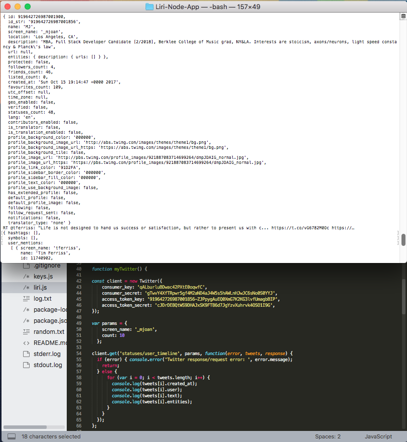
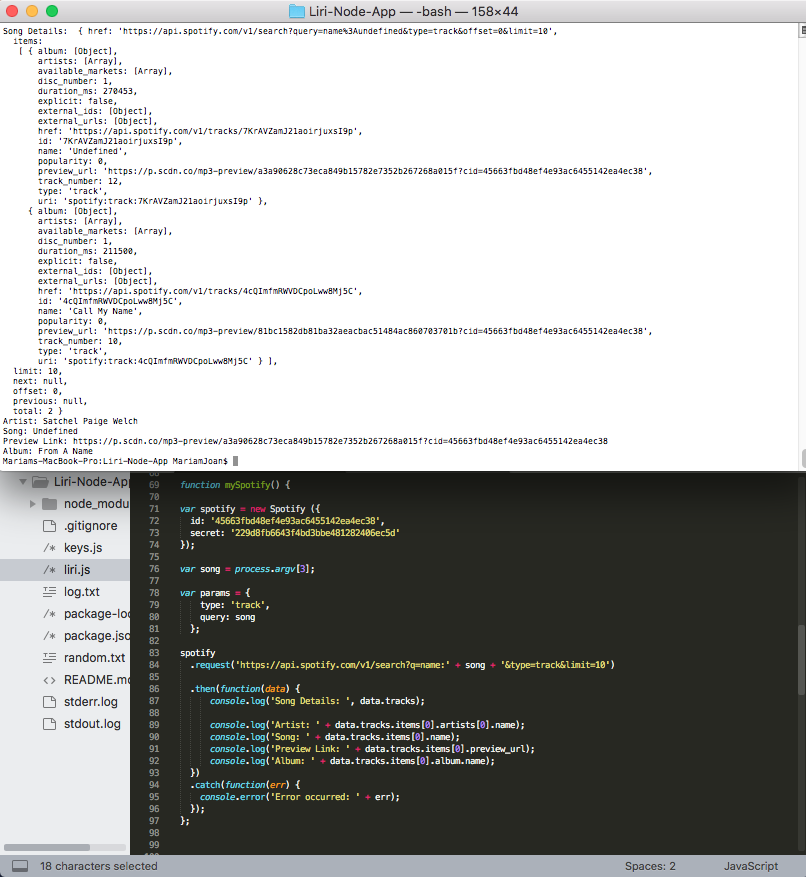
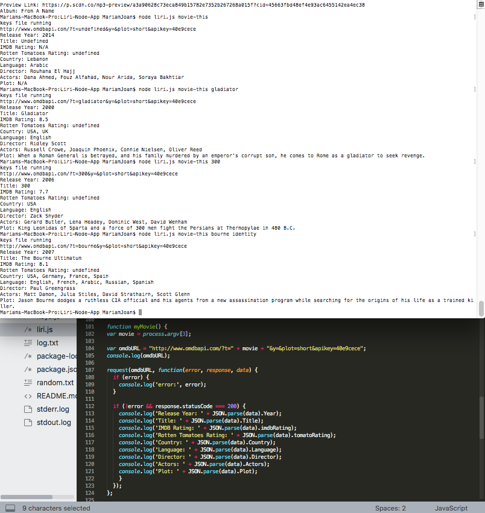
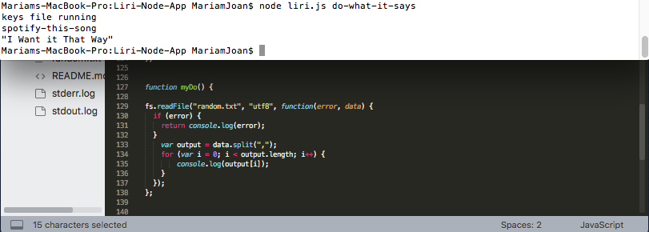

## Liri-Node-App, i.e. The 'LIRI Bot
## Overview

Here I created what is called a 'LIRI'. LIRI is like iPhone's SIRI. However, while SIRI is a Speech Interpretation and Recognition Interface, LIRI is a _Language_ Interpretation and Recognition Interface. LIRI will be a command line Node app that takes in parameters and gives you back data all in the command line! Thanks to the Coding Boot Camp for template code. Yay! 

### Process
3. To retrieve the data that will power this app, you'll need to send requests to the Twitter, Spotify and OMDB APIs. You'll find these Node packages crucial for your assignment.

   * [Twitter](https://www.npmjs.com/package/twitter)
   * [Spotify](https://www.npmjs.com/package/node-spotify-api)
   * [Request](https://www.npmjs.com/package/request)
     * You'll use Request to grab data from the [OMDB API](http://www.omdbapi.com).

5. Make a file called `random.txt`.
   * Inside of `random.txt` put the following in with no extra characters or white space:
     * spotify-this-song,"I Want it That Way"
6. Make a JavaScript file named `liri.js`
7. At the top of the `liri.js` file, write the code you need to grab the data from keys.js. Then store the keys in a variable.
8. Make it so liri.js can take in one of the following commands:

   * `my-tweets`
   * `spotify-this-song`
   * `movie-this`
   * `do-what-it-says`

### What Each Command Should Do

1. `node liri.js my-tweets`
   * This will show your last 20 tweets and when they were created at in your terminal/bash window.

2. `node liri.js spotify-this-song '<song name here>'`

   * This will show the following information about the song in your terminal/bash window
     * Artist(s)
     * The song's name
     * A preview link of the song from Spotify
     * The album that the song is from
   * If no song is provided then your program will default to "The Sign" by Ace of Base.
   
   * You will utilize the [node-spotify-api](https://www.npmjs.com/package/node-spotify-api) package in order to retrieve song information from the Spotify API.
   * Like the Twitter API, the Spotify API requires you sign up as a developer to generate the necessary credentials. You can follow these steps in order to generate a **client id** and **client secret**:
   * Step One: Visit <https://developer.spotify.com/my-applications/#!/>
   * Step Two: Either login to your existing Spotify account or create a new one (a free account is fine) and log in.
   * Step Three: Once logged in, navigate to <https://developer.spotify.com/my-applications/#!/applications/create> to register a new application to be used with the Spotify API. You can fill in whatever you'd like for these fields. When finished, click the "complete" button.
   * Step Four: On the next screen, scroll down to where you see your client id and client secret. Copy these values down somewhere, you'll need them to use the Spotify API and the [node-spotify-api package](https://www.npmjs.com/package/node-spotify-api). See the 

3. `node liri.js movie-this '<movie name here>'`

   * This will output the following information to your terminal/bash window:
    
       * Title of the movie.
       * Year the movie came out.
       * IMDB Rating of the movie.
       * Rotten Tomatoes Rating of the movie.
       * Country where the movie was produced.
       * Language of the movie.
       * Plot of the movie.
       * Actors in the movie.

   * You'll use the request package to retrieve data from the OMDB API. Like all of the in-class activities, the OMDB API requires an API key. You may use `40e9cece`.

4. `node liri.js do-what-it-says`

   
   * Using the `fs` Node package, LIRI will take the text inside of random.txt and then use it to call one of LIRI's commands.
     * It should run `spotify-this-song` for "I Want it That Way," as follows the text in `random.txt`.
     * Feel free to change the text in that document to test out the feature for other commands.

##### Copyright
##### Coding Boot Camp (C) 2016. All Rights Reserved.
